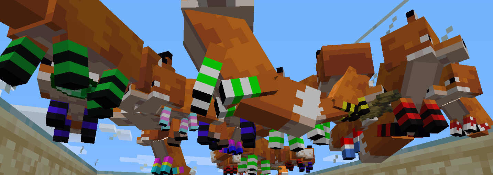

# Fox Sox
Have you ever wished your Minecraft Foxes had better footwear? Do you think your orange fluffy friends need to stay warm in the virtual world of Minecraft? Are you a degenerate who wants to see cuboid canidae with colourful [Programming Socks](https://i.kym-cdn.com/photos/images/newsfeed/001/584/957/ea7.png)?

Well, this vanilla-style texture addon does exactly what it says on the tin - it adds Soxes to your Foxes.  
  
Version: 0.1.4  
Author: Alan Lovell  
Source: nlovell.dev/Fox-Sox 
  
Compatible with every version of Minecraft that has foxes, so far.
Tested on 1.14.2

## How to use

Download this repository as a .zip (click [here](https://github.com/nlovell/Fox-Sox/archive/master.zip)), then add it to your ``.minecraft\resources`` folder.  
If you don't have Optifine installed, feel free to unzip this pack, then move the desired fox/fox-sleep images out of ``foxsox\assets\minecraft\optifine\random\entity\fox`` and into ``foxsox\assets\minecraft\textures\entity\fox``.
If you do have Optifine installed, the foxes will spawn with random sock textures. Neat, huh?

## Sox list
There's a bunch of fun sock designs in this addon pack.
1) Socked Fox
2) A sockless Friend
3) Blue and black
4) Dark purple and black
5) Trans rights!
6) Green and white
7) Yellow and black
8) White with red dots
9) White with hearts
10) Yellow and light orange
11) Dutch Flag
12) Bisexual pride!
13) Pansexual pride!
14) Flag of Andorra
15) Green and black
16) [Programming Socks](https://i.kym-cdn.com/photos/images/newsfeed/001/584/957/ea7.png)

## Q and A

`What do the version numbers mean?`  
Not a lot. Probably me being picky about stuff, or adding new socks.

 `Why didn't you cover their toe beans?`  
 Jesus christ I'm not putting that much effort into what ammounts to a visual shitpost.
 
 `Okay but seriously their feets look cold :(`  
 Yeah, but they need to have their claws out to be able to murder zombies and stuff. Grip. Efficiency. I don't know?
 If you want to fix it, submit a pull request on the Github page.
